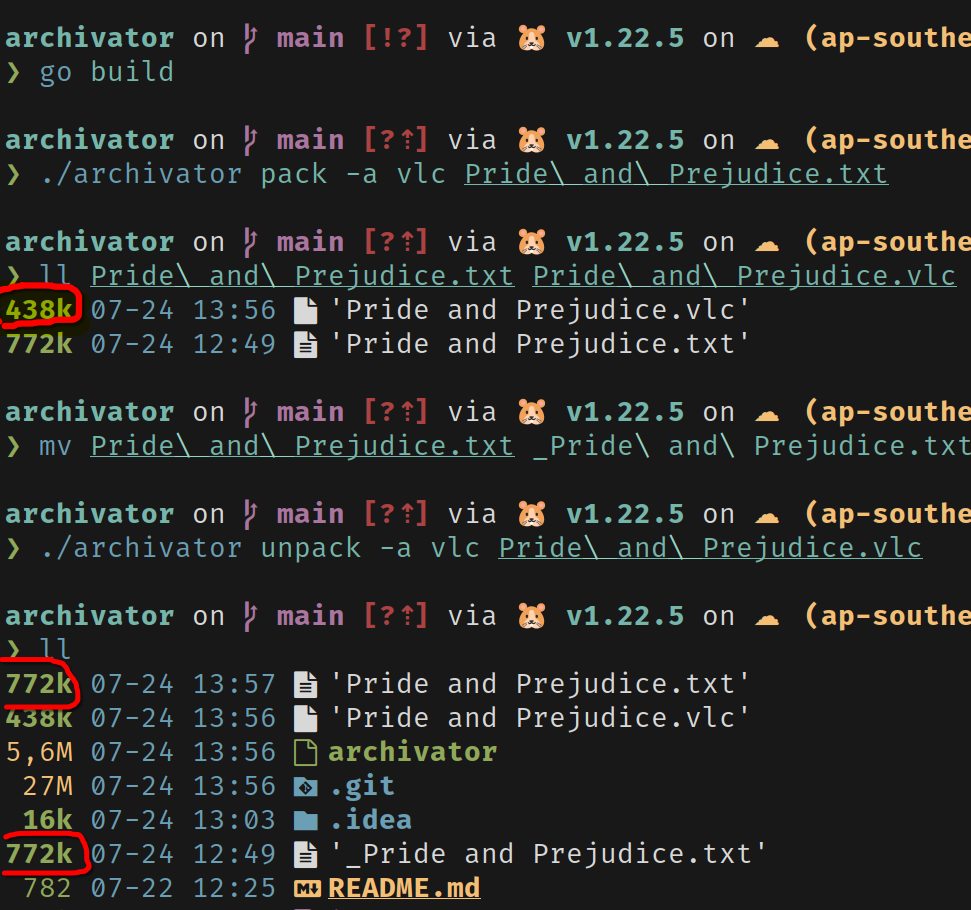

# archivator

## Description
This is a simple archivator that can compress and decompress files.

## Features
- Compression method: 
    - Variable Length Coding (VLC) algorithm.
    - Shannon-Fano algorithm.

## Usage

### Install

1. Clone the repository
2. Build the project
```bash
go build
```

### Compress file
```bash
./archivator pack -a <algorithm> <file>
```

### Decompress file
```bash
./archivator unpack -a <algorithm> <file>
```


### Example

#### Compress file using Shannon-Fano algorithm
```bash
./archivator pack -a vlc Pride\ and\ Prejudice.txt
```
#### Decompress file using Shannon-Fano algorithm
```bash
./archivator unpack -a vlc Pride\ and\ Prejudice.vlc
```

### Screenshots


#### As you can see the size of the file has decreased 
> Book file compressed and correctly decompressed back.
Decoded file is the same as the original file.

## References
- [Shannon-Fano algorithm](https://en.wikipedia.org/wiki/Shannon%E2%80%93Fano_coding)
- [Variable Length Coding (VLC) algorithm](https://en.wikipedia.org/wiki/Variable-length_code)